```{r setup, include=FALSE}
knitr::opts_chunk$set(echo = FALSE, warning = FALSE, message = FALSE)

```

```{r libs}

library(tidyverse)
library(vcd) # for mosaic plot
library(cowplot) # for ggdraw
library(dagitty)
library(ggdag)
library(patchwork)
data("UCBAdmissions") # for Berkeley data

```

## Co nás dnes čeká?

1)  Popisné statistiky
2)  Kauzální inference
3)  P-hodnota a replikační krize

# Popisné statistiky

## Statistika je když... {.flexbox .vcenter}

**Efektivita vakcíny Pfizer-BioNTech je 73 %.**

**11,5 % lidí v Česku je ohroženo chudobou.**

::: {.notes}
**Efektivita vakcíny** je definována jako relativní pokles rizika. Tj. v očkované skupině je zasaženo o 73 % méně lidí, než by se nakazilo bez vakcíny. (Neznamená to, že 27 % z očkovaných bude zasaženo. Neznamená, že 73 % si utvoří protilátky.) Co se myslí pojmeme "zasaženo"? To může být různé. Klíčové se ptát, efektivita proti čemu: [V tomto případě](https://www.thelancet.com/journals/lancet/article/PIIS0140-6736(21)02183-8/fulltext) proti nakažení, dále 90 % efektivita proti hospitalizaci. Dále víme, že efektivita proti nákaze poklesla z 88 % po 1 měsíci na 47 % po 5 měsících. **Chudoba** ukazatel ohrožení chudobou a sociálním vyloučením má jasnou, ale ne moc intuitivní definici, viz další snímek.
:::

## Ohrožení chudobou a sociálním vyloučením

::: {.centered}
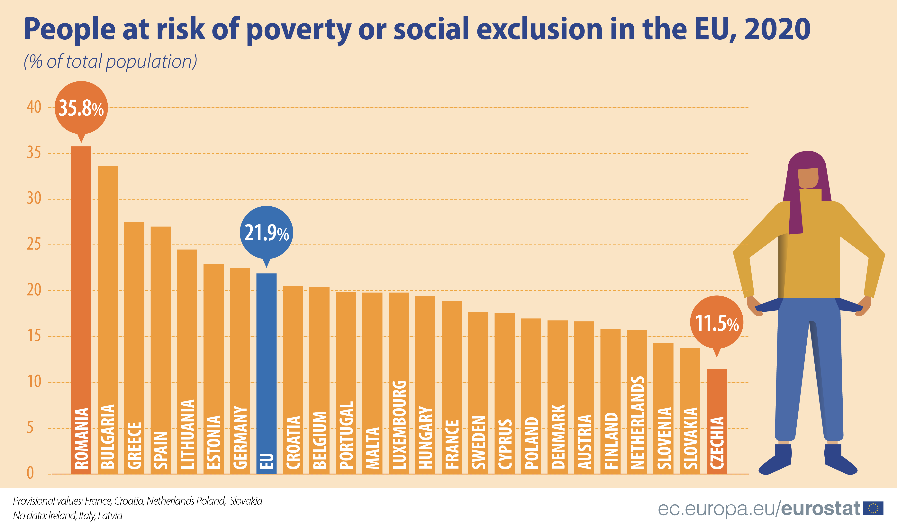{width="70%"}
:::

<font size="2">[Zdroj Eurostat](https://ec.europa.eu/eurostat/web/products-eurostat-news/-/edn-20211015-1#:~:text=In%202020%2C%20there%20were%2096.5,data%20published%20by%20Eurostat%20today.)</font>

> -   Jak byste takto nízkou míru ohrožení chudobou u nás vysvětlili?

## Co je ohrožení chudobou a sociálním vyloučením?

<blockquote>

At risk of poverty or social exclusion, abbreviated as AROPE, corresponds to the sum of persons who are either at risk of poverty, or severely materially and socially deprived or living in a household with a very low work intensity.

<font size="3">[Eurostat](https://ec.europa.eu/eurostat/statistics-explained/index.php?title=Glossary:At_risk_of_poverty_or_social_exclusion_(AROPE))</font>

</blockquote>

> -   Ale co to znamená?

::: {.notes}
**At risk of poverty rate** = share of people with an equivalised disposable income (after social transfer) below the at-risk-of-poverty threshold, which is set at 60 % of the national median equivalised disposable income after social transfers. **Severe material deprivation rate** = cannot afford at least 4 out of 9 predefined material items considered by most people to be desirable or even necessary to lead an adequate life. **Low work intensity indicator** = households where the adults (those aged 18-59, but excluding students aged 18-24) worked a working time equal or less than 20 % of their total combined work-time potential during the previous year.
:::

## Operacionalizace

Překlopení pojmů z jazyka teorie do observačního jazyka.

Chudoba:

1)  Metrika (například příjmová chudoba)
2)  Hranice chudoby (například 60 % mediánu v dané ekonomice)
3)  Agregace

## Způsob agregace chudoby a politické implikace

::: {.centered}

:::

## Základní reprodukční číslo {.flexbox .vcenter}

$$\Huge R_0$$

## Základní představa pro $R_0 = 2$


<font size="2">[Zdroj obrázku Michigan Health Lab](https://images.app.goo.gl/qdgNZJQBKTSKWKhM8)</font>

## Blíže skutečnosti (pro $R_0 = 3$)

::: {.centered}
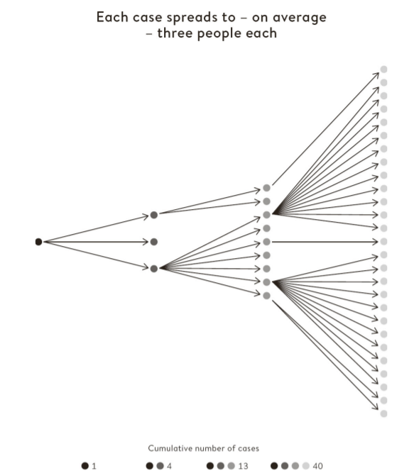{width="40%"}
:::

<font size="2">Převzato z @spiegelhalter2021</font>

## Odhad rozložení počtu nakažených

::: {.centered}
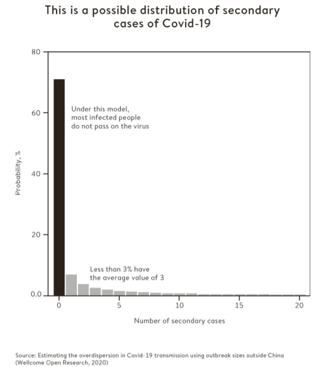{width="45%"}
:::

<font size="2">Převzato z @spiegelhalter2021</font>

::: {.notes}
"when introduced into susceptible communities, around 75% of people who catch the virus do not go on to infect anyone else, while a small minority (10%) lead to the great majority (80%) of new cases. There are several reasons for this. Some may be particularly infectious, while 'super-spreader' events can also occur. There was a choir practice in Washington State where one person with 'cold-like' symptoms led to 52 infections of 60 other singers."
:::

## Přijetí na Univerzitu v Berkeley dle pohlaví

```{r}
mosaic( ~ Gender + Admit, data = UCBAdmissions)
```

## Zohlednění fakult

```{r}
rownames(UCBAdmissions) <- c("A", "R")

mosaic( ~ Dept + Gender + Admit, data = UCBAdmissions,
       highlighting = "Admit", highlighting_fill = c("lightgreen", "pink"),
       direction = c("v","h","v"))


```

## Obecný problém: Simpsonův paradox

```{r}
p1 <- ggdraw() + draw_image("figures/05_Simpson_wiki_groups.png", scale = 0.9)
p2 <- ggdraw() + draw_image("figures/05_Simpson_wiki_combined.png", scale = 0.9)

plot_grid(p1, p2)
```

## Co si odnést?

-   Nestačí chroustat čísla, je potřeba rozumět tomu, co znamenají. "Avoid premature enumeration." (T. Harford)
-   Operacionalizace je zřídka (pokud vůbec kdy) neutrální. Co a jak sledujeme má implikace pro naše rozhodování.
-   Popisná statistika může zastírat mechanismus, který působí v realitě.
-   Vztahy na individuální a agregované úrovni mohou být dramaticky odlišné (Simpsonův paradox).

## Kde se začíst? {.small}

Skvělá kniha pro rozvoj datové gramotnosti každodenního života je **How to Make the World Add Up** [@harford2021]. Tim Harford je dlouhodobý tvůrce podcastu More or Less (BBC) a jeho příklady jsou strhující, skvěle podané a prakticky užitečné - kniha není psána poraženecky, že nás statistika jen klame, ale pozitivně - co můžeme dělat lépe.

Pokud to chcete vzít ještě více od podlahy a zaměřit se na sebe a svůj postoj ke světu a poznávání, doporučuji knihu **The Scout Mindset** [@galef2021] postavenou na metafoře dvou myšlenkových nastavení: vojáka a zvěda.

Pokud byste měli chuť si osvěžit úplně základní statistiku netechnickou formou, doporučuji moderní přístup k výuce statistiky jako investigativního procesu **The Art of Statistics** [@spiegelhalter2019]

# Kauzální inference

## Randomized controlled trial (RCT)

::: {.centered}
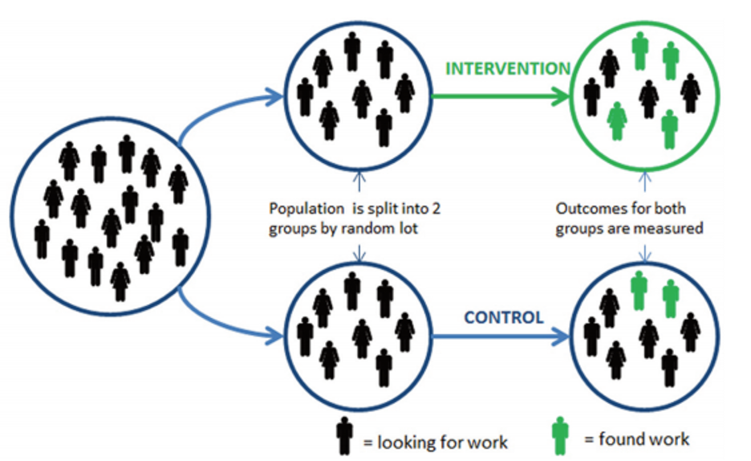{width="75%"}
:::

<font size="2">[Haynes a kol., 2012](https://www.gov.uk/government/uploads/system/uploads/attachment_data/file/62529/TLA-1906126.pdf)</font>

## Statistické modely

-   deskriptivní, prediktivní, explanativní [@shmueli2010]

-   explanativní - kauzální ambice, zásadní je teoretické ukotvení

## DAG (directed acyclic graph)

-   heurestický nástroj pro explanativní modelování
-   pomáhá vyjasnit teoretický model, než se pustíme do statistického modelování

## 4 základní elementy zmatení

-   y ... závislá proměnná
-   x ... nezávislá proměnná
-   z ... třetí proměnná

::: {.centered}
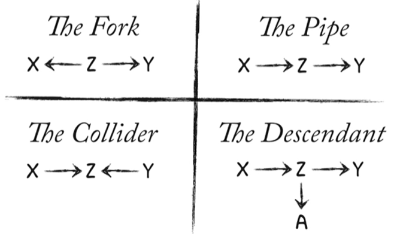{width="60%"}
:::

<font size="2">Obrázek z [McElreath, Statistical Rethinking 2022](https://www.youtube.com/watch?v=UpP-_mBvECI&list=PLDcUM9US4XdMROZ57-OIRtIK0aOynbgZN&index=6)</font>

## Kontrola vlivu třetí proměnné (conditioning, stratification)

-   kontrolní proměnná ve statistickém modelu
-   výběr vzorku
-   stratifikace v rámci analýzy (oddělené analýzy)

## Nepravá korelace

::: {.centered}
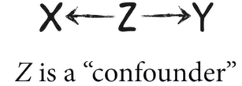{width="30%"}
:::

<font size="1">

<center>

Obrázek z [McElreath, Statistical Rethinking 2022](https://www.youtube.com/watch?v=UpP-_mBvECI&list=PLDcUM9US4XdMROZ57-OIRtIK0aOynbgZN&index=6)

</center>

</font>

-   mezi X a Y existuje asociace
-   po kontrole Z asociace mizí

::: {.notes}
Například čím více zmrzliny se prodá, tím více lidí se utopí (sluníčko). Čím více svateb, tím více rozvodů (věk vstupu do manželství).
:::

## Střední člen (the Pipe)

::: {.centered}
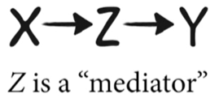{width="30%"}
:::

<font size="1">

<center>

Obrázek z [McElreath, Statistical Rethinking 2022](https://www.youtube.com/watch?v=UpP-_mBvECI&list=PLDcUM9US4XdMROZ57-OIRtIK0aOynbgZN&index=6)

</center>

</font>

-   mezi X a Y existuje asociace
-   po kontrole Z asociace mizí (ale chceme to?)

::: {.notes}
Například vzdělanější lidé spíše volí pravicové strany. Možná chceme kontrolovat pro příjem a ukázat, že příjem je mediátor. Pokud se stejně vzdělaní lidé neliší v příjmu, nemá vzdělání další dopad na volbu strany. Ale možná mediátor kontrolovat nechceme, viz následující snímek.
:::

## Když pro mediátor kontrolovat nesmíme...

Houbová plíseň snižuje růst rostliny. Chci testovat, jak nasazení chemického ošetření ochrání rostlinu před tímto vlivem.

Ošetření -\> Plíseň -\> Růst

Nesmím kontrolovat pro plíseň, pokud nás zajímavá efekt ošetření na růst.

> -   post-treatment bias [@montgomery2018]

::: {.notes}
Nedávejte do regresního modelu vše, co měříte. Opírejte se o teorii.
:::

## Collider

::: {.centered}
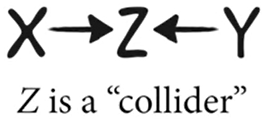{width="30%"}
:::

<font size="1">

<center>

Obrázek z [McElreath, Statistical Rethinking 2022](https://www.youtube.com/watch?v=UpP-_mBvECI&list=PLDcUM9US4XdMROZ57-OIRtIK0aOynbgZN&index=6)

</center>

</font>

-   mezi X a Y není asociace
-   po kontrole Z se asociace mezi nimi objeví

## Příklad toho, jak nás může collider zmást


::: {.centered}
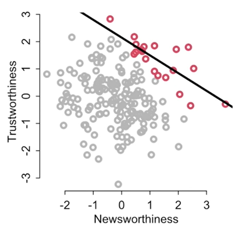{width="50%"}
:::

<font size="1">

<center>

Obrázek z [McElreath, Statistical Rethinking 2022](https://www.youtube.com/watch?v=UpP-_mBvECI&list=PLDcUM9US4XdMROZ57-OIRtIK0aOynbgZN&index=6)

</center>

</font>

::: {.notes}
Původně žádná korelace, ale při zaměření jen na ty, kterým bylo uděleno financování, vidíme negativní vztah. Podobně negativní vztah mezi inteligencí a pracovitostí mezi univerzitními studenty. Mezi herci atraktivita negativně asociována s talentem (opět, vliv výběru). To je kontrola skrze vzorek.    
:::

## Další příklad collideru

::: {.centered}
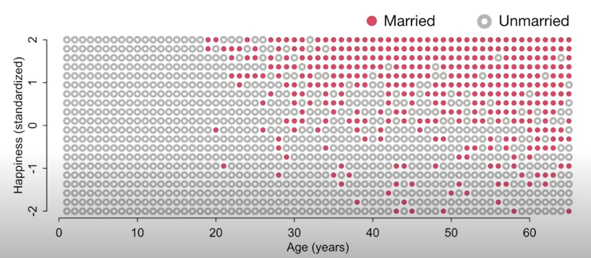{width="95%"}
:::

<font size="1">

<center>

Obrázek z [McElreath, Statistical Rethinking 2022](https://www.youtube.com/watch?v=UpP-_mBvECI&list=PLDcUM9US4XdMROZ57-OIRtIK0aOynbgZN&index=6)

</center>

</font>


::: {.notes}
Případně v modelu kvůli špatnému modelu: Vztah věku a štěstí. Předpokládejem, že mezi nimi není žádný vztah. Ale jak věk, tak štěstí zvyšuje šanci na sňatek. Pokud kontrolujeme pro manželství (stratifikujeme podle manželství), uměle vytváříme negativní vztah mezi štěstím a věkem, i když věk v naší hypotetické realitě štěstí nijak neovlivňuje (funguje jako konstanta od narození do smrti).
:::


## Descendant 

::: {.centered}
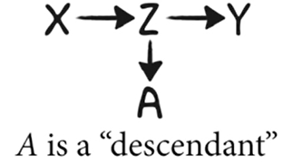{width="30%"}
:::

<font size="1">

<center>

Obrázek z [McElreath, Statistical Rethinking 2022](https://www.youtube.com/watch?v=UpP-_mBvECI&list=PLDcUM9US4XdMROZ57-OIRtIK0aOynbgZN&index=6)

</center>

</font>


- descendant se chová podle toho, na co je napojen (zda je Z confonder, pipe, nebo collider)
- například pokud by Z byl collider, nesmím kontrolovat ani pro A

::: {.notes}
Například v přechozím příkladu by mohlo být problématické kontrolovat pro děti, pokud by děti byly silným descendantem manželství.  
:::


## Kde si přečíst víc?

Vlivné a přístupné pojednání o kauzalitě je The Book of Why [@pearl2018] od současné klíčové postavy teorie kauzálního výstupu. Šikovnou malou knihou na přečtení od začátku do konce je Mastering Metrics [@angrist2014] od autorů řady vlivných ekonomických kauzálních studií. Naopak dobrou "referenční" tlustou knihou je Counterfactuals and Causal Inference [@morgan2014].

# P-hodnota a replikační krize

## Nabízet méně, prodávat více (choice paralysis)

::: {.centered}
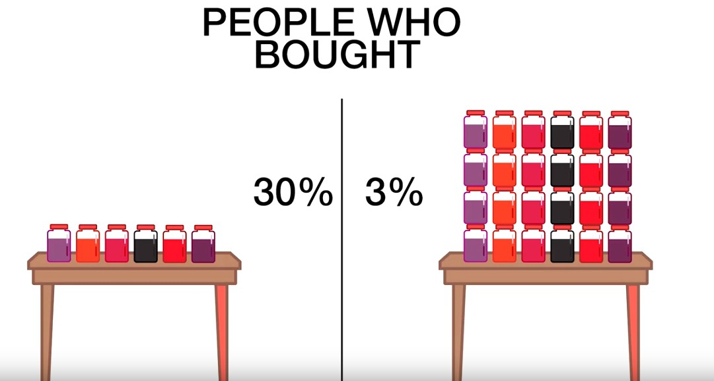{width="70%"}
:::

<font size="2">[Obrázek z Medium.com](https://medium.com/@prathameshw95/the-jam-experiment-and-its-effects-in-day-to-day-life-1cec6d03c94e)</font>

::: {.notes}
Původní studie [@iyengar2000] nasbírala tisíce citací. Pokusy o replikaci ale nebyly přesvědčivé, průměrný efekt byl 0. Především ty, které "nic nenaměřily" se ale nedařilo publikovat.
:::

## Zkreslení přeživších

::: {.centered}
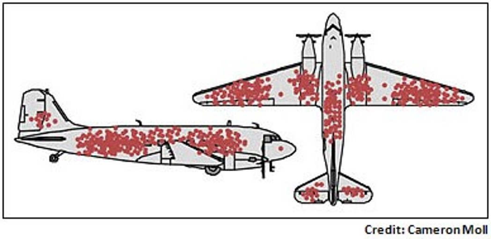{width="70%"}
:::

::: {.notes}
Podobné: Pokud se ptáte na spokojenost jen těch zákazníků, kteří službu úspěšně použili a ne těch, kdo například nezvládli registraci nebo se jinak nevyznali v systému. 55 000 dolarů vybraných na bramborový salát na Kickstarteru.
:::

## Pořádné zatřesení

-   Daryl Bem: Lidé vidí do budoucnosti (Journal of Personality and Social Psychology, 2011)

> -   Pokus o replikaci nevyšly, ale časopis je odmítl publikovat

::: {.notes}
[Původní Bemův článek](https://prevention.ucsf.edu/sites/prevention.ucsf.edu/files/uploads/2011/02/bem2011.pdf), publikovaný 2011, ale online first už 2010. Příklady Bemových experimentů: lidé měli tipovat, za kterým ze dvou černých čtverců na monitoru je určitý obrázek (ten se náhodně přiřadil až po tipnutí. Tipovali lépe než náhodně. Lidé měli dělat nácvik paměťového cvičení až poté, co paměťové cvičení uskutečnili. Polovina, která po cvičení náhodně dělala nácvik, měla lepší výsledky (efekt do minulosti). [Článek na Slate.com vypráví příběh detailně](https://slate.com/health-and-science/2017/06/daryl-bem-proved-esp-is-real-showed-science-is-broken.html).
:::

## Publikační zkreslení, replikační krize a Brian Nosek

Nosek shromáždil síť psychologů - replikace 100 studií z respektovaných psychologických časopisů. Jen v 39 případech replikovaly výsledky původních studií.

[Článek o replikaci 100 studií v časopise Science, rok 2015.](https://www.science.org/doi/10.1126/science.aac4716)

## Důvody replikační krize

-   Publikační zkreslení
-   Malá prestiž replikačního výzkumu
-   P-hacking

::: {.notes}
"If you have a result that looks publishable but fragile, the logic of science tells you to try to disprove it. Yet the logic of academic grants and promotions tells you to publish at once, and for goodness' sake don't prod it too hard." [@harford2021]
:::

## P-hacking v podání Derrena Browna

<iframe src="https://www.youtube.com/embed/XzYLHOX50Bc" data-external="1">

</iframe>

::: {.notes}
[A video where D. Brown explains how they shooted a video with 10 heads in a row](https://www.youtube.com/watch?v=n1SJ-Tn3bcQ)
:::

## Nenápadný p-hacking

-   1024 výzkumníků se pokusí hodit 10krát po sobě pannu

-   výzkumníkovi se nepovede experiment, tak ho zahodí a zkusí něco jiného

-   výslekdy nejsou statisticky signifikantní,...

    -   ... ale kdyby se sebralo pár pozorování navíc
    -   ... ale kdyby se data zanalyzovala po skupinách
    -   ... ale kdyby se data zanalyzovala jiným modelem
    -   ... ale kdyby se vyloučila odlehlá pozorování

## HARKing

Hypothesis after results known

## John Ioannidis ... na jeho slova došlo

-   V roce 2005 publikoval vizionářský článek ["Why Most Published Research Findings Are False"](https://journals.plos.org/plosmedicine/article?id=10.1371/journal.pmed.0020124), kde tuto situaci předpověděl.

## A ne, POWER POSING asi nefunguje

... i když ten Ted Talk má na YouTube 20 miliónů zhlédnutí

::: {.centered}
{width="25%"}
:::

<font size="2">[Zdroj Wikipedie](https://en.wikipedia.org/wiki/Power_posing)</font>

::: {.notes}
Hypotéza "fake it till you make it" - dělejte power posing, budete se cítit silněji (Amy Cuddy, výsledky: změní se ochota gamblovat, vzroste testosteron, poklesne kortizol, lidé budou mít lepší výkon při pracovním pohovoru). Několik pokusů o replikaci selhalo.
:::

## Jak z toho ven?

-   Pre-registrace. Top lékařské časopisy už jinak ani studie nepublikují (i když své standardy často nedodržují příliš přísně), ostatní obory to pomalu začínají dohánět (a všude to není možné)
-   Časopis Trials (medicína) - publikace RCT nezávisle na výsledku a signifikanci.
-   Cochrane Collaboration (systematic reviews, medicína)
-   Campbell Collaboration (systematic reviews, sociální vědy, vzdělávání)

## Co je p-hodnota?

"Informally, a p-value is the probability under a specified statistical model that a statistical summary of the data (e.g., the sample mean difference between two compared groups) would be equal to or more extreme than its observed value." [@wasserstein2016]

::: {.notes}
"Researchers often wish to turn a p-value into a statement about the truth of a null hypothesis, or about the probability that random chance produced the observed data. The p-value is neither. It is a statement about data in relation to a specified hypothetical explanation, and is not a statement about the explanation itself." [@wasserstein2016]
:::

## Kritika p-hodnoty {.smaller}

-   p-hodnota je nevhodně používána jako míra důležitosti výsledku (přitom nulová hypotéza může být zcela banální)
-   p-hodnota je používána jako doklad toho, že byl učiněn vědecký objev, při zanedbání mnohem důležitějších kritérií (design studie, kvalita měřícího nástroje, předchozí evidence,...)
-   p-hodnota je používána nesprávně (p-hacking)
-   p-hodnota je nesprávně interpretována (např. nezamítání nulové hypotézy je vnímáno jako evidence ve prospěch nulové hypotézy)
-   obvykle není věcný rozdíl mezi p-hodnotou 5,1 a 4,9

## Další čtení o p-hodnotě

Zásadní text je [vyjádření American Statistical Association](https://amstat.tandfonline.com/doi/full/10.1080/00031305.2016.1154108#.YjeIWOqZO3C). Doporučit lze také [tento blog](http://daniellakens.blogspot.com/2021/11/why-p-values-should-be-interpreted-as-p.html) Daniela Lakense.

## Reference {.smaller}
