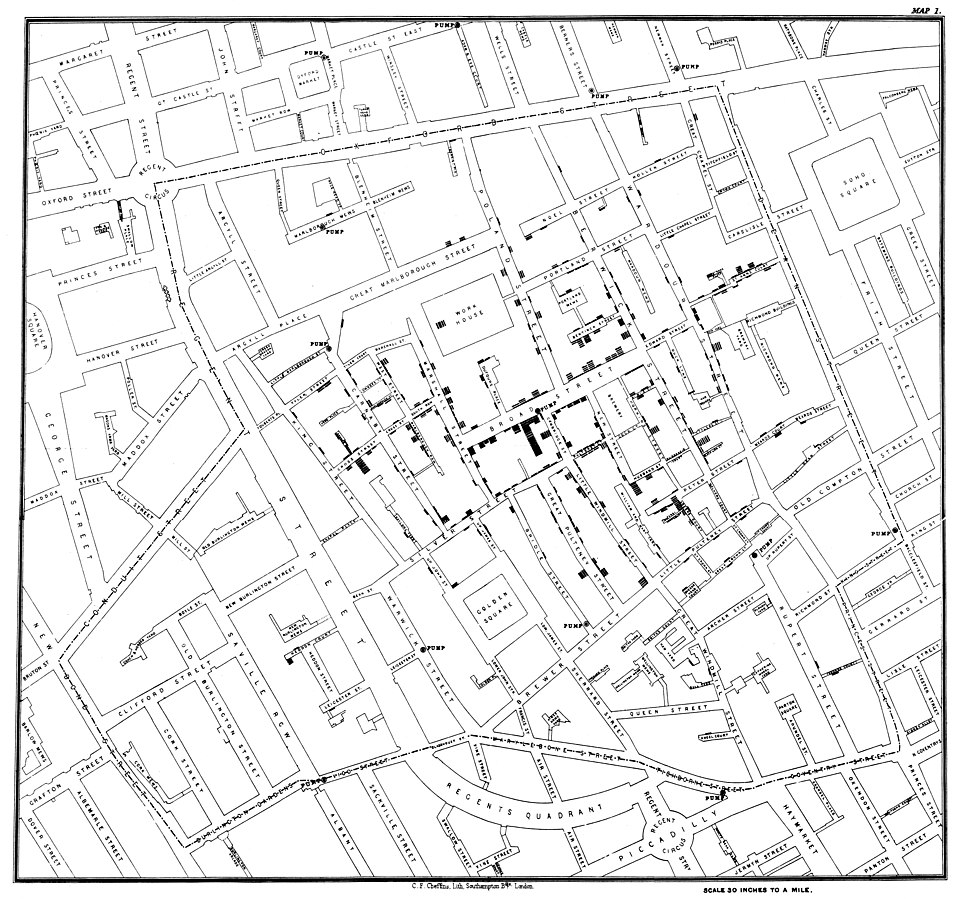

```{r setup, include=FALSE}
knitr::opts_chunk$set(echo = FALSE, warning = FALSE, message = FALSE)

```

```{r libs and data}

library(tidyverse)
library(here)
library(ggeffects)
library(scales)
library(patchwork)
library(summarytools)
library(palmerpenguins)
library(cowplot)
countries <- read_rds(here("slides","data", "countries.rds"))

```


```{=html}
<style>
.forceBreak { -webkit-column-break-after: always; break-after: column; }
</style>
```


## Přehled témat

* Proč grafy raději než text
* Obecné principy vizualizace
* Architektura vizualizace (grammar of graphics)

# Proč grafy raději než text?

## Florence Nightingale a Krymská válka (1850s)

::: {.centered}

:::

<font size="2">[Zdroj obrázku Highcharts.com](https://www.highcharts.com/blog/tutorials/166-nightingale-s-diagram/)</font>

::: {.notes}
Blue diesease from poor hygiene. Red battle wounds, Black other causes. **Nightingale**: first female fellow of the Royal Satistical Society, teamed up with a brilliant statistician of poor parents William Farr who lacked Nightingale's fame and political connections. About lobbying with Queen Victoria: 'She may look at it because it has pictures.' 16 000 of the 18 000 deaths were from preventable disease.
:::

## John Snow a epidemie cholery v Londýně

::: {.centered}
{width="55%"}
:::

<font size="2">[Zdroj obrázku Highcharts.com](https://en.wikipedia.org/wiki/File:Snow-cholera-map-1.jpg)</font>

::: {.notes}
Thanks to Snow's visualizations, suspicion fell on watr sources rather than 'bad air' which was the main suspect of causing cholera until then.
:::

## Spočítejte všechny trojky

::: {.centered}

:::

<font size="2">Zdroj @ware2012</font>

## Spočítejte všechny trojky

::: {.centered}

:::

<font size="2">Zdroj @ware2012</font>

## Lépe si pamatujeme vizuálně

::: {.centered}

:::

<font size="2">Zdroj @medina2014</font>

::: {.notes}
Zrak je náš hlavní smysl, svět vidíme skrze obrazy. Text musíme nejprve dekódovat a pak si ho abstraktně představit. 
:::

# Obecné principy vizulizace

## Eduard Tufte

Klíčová postava moderního přístupu k vizualizaci informací.

Chartjunk; data : ink ratio; data density; micro - macro reading. 

::: {.notes}
**Chartjunk** nepotřebné dekorace, **data : ink ratio** - snaha maximalizovat, tj. zachytit hodně data s použitím málo inkoustu; **data density** - snaha zobrazit co nejvíce dat při důrazu na hlavní trendy; **micro-macro reading** z grafu jsou jasné trendy, ale zároveň nabízí možnost detailní inspekce. 
:::

## Obecné principy vizulizace

1) Důraz na data
1) Čitelnost
1) Integrita

# PRINCIP 1: Důraz na data

## PRINCIP 1: Důraz na data 

Méně je více. Grafy mají efektivně komunikovat informace, design má tento cíl podpořit, ne zamlžit.

::: {.centered}
{width=50%}
:::

## Poměr DATA : INKOUST

“Above all else show the data.” (Eduard Tufte)

::: {.centered}
{width=80%}
:::

<font size="2">[Zdroj obrázku](https://simplexct.com/data-ink-ratio)</font>


## Méně je více

::: {.centered}

:::

<font size="2">[Zdroj obrázku](http://socialmediaguerilla.com/content-marketing/less-is-more-improving-the-data-ink-ratio/)</font>

## Někdy se trochu inkoustu navíc vyplatí...

::: {.centered}
{width=80%}
:::

<font size="2">[Zdroj obrázku](https://visguides.org/t/data-ink-ratio-principle-how-to-use-it/72/5)</font>


## Nepoužívejte 3D grafy

::: {.centered}
{width=80%}
:::

<font size="2">[Zdroj obrázku](https://www.slideshare.net/vis4/making-data-visualizations-a-survival-guide)</font>


## Nejde jen o zbytečný efekt, ale aktivně škodí

::: {.centered}
{width=70%}
:::

<font size="2">[Zdroj obrázku](https://www.slideshare.net/vis4/making-data-visualizations-a-survival-guide)</font>

# Důraz na data: Nespoléhejte se na default

## Excel koláčový graf

```{r, fig.align='center', fig.cap='Financování dle zdroje, v tisících Kč'}
# note, the path needs to add "slides/" before figures to work in console, but be like this to compile
p1 <- ggdraw() + draw_image("figures/excel_default_pie.png", scale = 0.9)
p2 <- ggdraw() + draw_image("figures/excel_remake_pie.png", scale = 0.9)

plot_grid(p1, p2)
```

## Excel koláčový graf - důraz 

```{r, fig.align='center', fig.cap='Financování dle zdroje, v tisících Kč'}
# note, the path needs to add "slides/" before figures to work in console, but be like this to compile
p1 <- ggdraw() + draw_image("figures/excel_default_pie.png", scale = 0.9)
p2 <- ggdraw() + draw_image("figures/excel_remake_pie2.png", scale = 0.9)

plot_grid(p1, p2)
```


##  Excel sloupcový graf {.columns-2}

PŘED

{width=90%}

<p class="forceBreak">

</p>

PO

{width=90%}

## Excel sloupcový graf časová řada {.columns-2}

PŘED

{width=90%}

<p class="forceBreak">

</p>

PO

{width=90%}

## Excel spojnicový graf {.columns-2}

PŘED

{width=90%}

<p class="forceBreak">

</p>

PO

{width=90%}

## Excel likertovská škála (diverging chart) {.columns-2}

PŘED

{width=90%}

<p class="forceBreak">

</p>

PO

{width=90%}

## Excel likertovská škála - varianta (diverging chart) {.columns-2}

PŘED

{width=90%}

<p class="forceBreak">

</p>

PO

{width=90%}

# PRINCIP 2: Čitelnost

## PRINCIP 2: Čitelnost

Respekt k tomu, jak funguje lidská kognice.

::: {.centered}

:::

<font size="2">[Zdroj Christopher G. Healey](https://www.csc2.ncsu.edu/faculty/healey/PP/index.html)</font>


## Koláčové grafy se nehodí na provonávání


::: {.centered}
{width=70%}
:::

<font size="2">[Zdroj Wiki](https://en.wikipedia.org/wiki/Pie_chart#/media/File:Piecharts.svg)</font>

## % university-educated in new EU members

```{r fig.height=5.5, fig.pos="center"}
c_com <- 
  countries %>% 
  filter(postsoviet == "yes", eu_member == "yes") %>% 
  filter(!is.na(uni_prc))

gg1 <- 
  c_com %>%
  ggplot(aes(x=country, y=uni_prc))+
  geom_col()

gg2 <- 
  c_com %>%
  ggplot(aes(x=fct_reorder(country, uni_prc, .desc=TRUE), y=uni_prc))+
  geom_col()+
  scale_x_discrete(guide = guide_axis(angle = 90))+
  labs(x=element_blank(),
       y=element_blank())


gg3 <- 
  c_com %>%
  ggplot(aes(x=fct_reorder(country, uni_prc, .desc=TRUE), y=uni_prc))+
  geom_col()+
  scale_x_discrete(guide = guide_axis(angle = 90))+
  scale_y_continuous(labels = label_percent())+
  labs(x=element_blank(),
       y=element_blank())+
  theme_classic()

gg4 <- 
  c_com %>%
  ggplot(aes(x=fct_reorder(country, uni_prc), y=uni_prc))+
  geom_col()+
  geom_text(aes(label = round(uni_prc*100,0)), hjust = 2, color = "white")+
  scale_x_discrete()+
  scale_y_continuous(labels = label_percent())+
  labs(x=element_blank(),
       y=element_blank())+
  theme_classic()+
  coord_flip()

(gg1 + gg2)/(gg3 + gg4)

```


## Příklad zlepšení čitelnosti i důrazu {.columns-2}

SKUTEČNÁ PUBLIKACE

{width=90%}

<p class="forceBreak">

</p>

NÁVRH NA ZLEPŠENÍ

{width=75%}
<font size="2">[Schwabish, J. A. (2014) An Economist’s Guide to Visualizing Data](https://pubs.aeaweb.org/doi/pdf/10.1257/jep.28.1.209)</font>


## "Small multiples" zlepšují čitelnost časových řad {.columns-2}

SKUTEČNÁ PUBLIKACE

{width=90%}

<p class="forceBreak">

</p>

NÁVRH NA ZLEPŠENÍ

{width=90%}

<font size="2">[Schwabish, J. A. (2014) An Economist’s Guide to Visualizing Data](https://pubs.aeaweb.org/doi/pdf/10.1257/jep.28.1.209)</font>


## Pokud máte flexibilní nástroj, můžete být kreativní...

```{r, fig.align='center'}
# note, the path needs to add "slides/" before figures to work in console, but be like this to compile
p1 <- ggdraw() + draw_image("figures/comparison1.png", scale = 0.9)
p2 <- ggdraw() + draw_image("figures/comparison2.png", scale = 0.9)
p3 <- ggdraw() + draw_image("figures/comparison3.png", scale = 0.9)
p4 <- ggdraw() + draw_image("figures/comparison4.png", scale = 0.9)

plot_grid(p1, p2, p3, p4)
```

<font size="2">[Schwabish, J. A. (2014) An Economist’s Guide to Visualizing Data](https://pubs.aeaweb.org/doi/pdf/10.1257/jep.28.1.209)</font>


## S tímhle opatrně...

::: {.centered}
{width=70%}
:::

Může být užitečné pro dvě kategorie.

## Dobře zvládnutá datová hustota

::: {.centered}
{width=90%}
:::

<font size="2">Zdroj [Financial Times](blogs.ft.com/ftdata/2015/04/17/eu-unemployment-tracker/ )</font>


# PRINCIP 3: Integrita


## PRINCIP 3: Integrita

Vy rozhodujete o tom, jaké sdělení vizualizace vynese do popředí. Tím ale také nesete odpovědnost za možná zkreslení či přímo manipulace. 

::: {.centered}

:::

## Jak moc že to rostou ceny bytů?

::: {.centered}
{width=60%}
:::

## Problém osy y {.columns-2 .smaller} 

{width=95%}

<p class="forceBreak">

</p>

```{r, echo=FALSE,out.width="95%", out.height="20%",fig.show='hold',fig.align='center', fig.cap='axis y in -20 mil. (top), in 0 (bottom)'}

knitr::include_graphics(c("figures/byty2.jpg","figures/byty3.jpg"))

```

## Někdy je osa y arbitrární


```{r, echo=FALSE,out.width="49%", out.height="20%",fig.show='hold',fig.align='center'}

knitr::include_graphics(c("figures/teplota_a.png","figures/teplota_b.png"))

```


## Někdy je potřeba "zazoomovat"

::: {.centered}
{width=90%}
:::

## Pokud osa y nezačíná na 0 ...

* ... použijte "line chart", raději než "bar chart"
* ... upozorněte na to

::: {.centered}
{width=70%}
:::

<font size="2">[Zdroj obrázku Highcharts.com](https://medium.economist.com/why-you-sometimes-need-to-break-the-rules-in-data-viz-4d8ece284919)</font>


## Trápí nás chudoba nejméně ze všech evropských zemí?

::: {.centered}
{width="70%"}
:::

<font size="2">[Zdroj Eurostat](https://ec.europa.eu/eurostat/web/products-eurostat-news/-/edn-20211015-1#:~:text=In%202020%2C%20there%20were%2096.5,data%20published%20by%20Eurostat%20today.)</font>

## Vizualizace míry nejistoty

Zde data z července 2021.

<div class="centered">
{width="80%"}
</div>

## Nejistotu lze vizualizovat i u odhadů modelu

```{r}

m1 <- lm(hdi ~ uni_prc, data = countries)

p1 <- 
  countries %>% 
  ggplot(aes(x=uni_prc, y=hdi))+
  geom_point()+
  geom_smooth(method = "lm")+
  scale_x_continuous(labels = label_percent())+
  theme_classic()+
  labs(x="Percentage university educated",
       y=element_blank(),
       title = "Countries's human development index predicted by university education",
       subtitle = "Human development index measured on a scale 0-1", 
       caption = "35 European countries are displayed")

p1

```


## Pravdivá vizualizace, ale...


::: {.centered}

:::

<font size="2">[Zdroj obrázku](https://www.benzinga.com/analyst-ratings/analyst-color/17/06/9675339/celebrating-the-10th-anniversary-of-the-iphone-a-look-ba)</font>

## Obecné principy vizualizace - shrnutí{.smaller}

Důraz na data

* Defaultní nastavení je často potřeba změnit
* Ponechte jen ty prvky grafu, které mají informační hodnotu
* Nepoužívejte 3D grafy
* Přemýšlejte o tom, co chcete grafem říct

Čitelnost

* Respektujte lidskou kognici
* Vodorovné popisky grafu jsou lepší než svislé
* Přemýšlejte o tom, v jakém kontextu se s grafem čtenář setká
* Inspirujte se kreativními přístupy

Integrita

* Opatrně s osou y
* Komunikujte význam toho, co vizualizujete
* Zohledněte míru nejistoty

::: {.notes}
**Důraz na data** Data nemluví za sebe, vy rozhodujete o tom, na co chcete vizualizací upozornit (ale nesmíte manipulovat); barvy používejte jako nositele informace, ne jako ozdobu; 
**Čitelnost** Pokud to jde, data popisujte přímo v grafu; použití koláčových grafů minimalizujte, určitě nepoužívejte pro srovnání složení více skupin rozdíly v délce vs. rozdíly v úhlu); Přizpůsobte svoji vizualizaci účelu (jednodušší do prezentace, složitější do článku); Titulek v prezentaci nemusí jen pojmenovávat, může vyprávět příběh. V článku větčinou příběh vyprávíme spíše v textu.
:::

# Architektura vizualizace (grammar of graphics)

## Leland Wilkinson an 'The Grammar of Graphics' (book)

Co dělá dobrou vizualizaci? Jednotlivé komponenty...

1) Data
1) Proměnné
1) Algebra
1) Měřítko
1) Geometrie (line chart, bar chart, ...)
1) "Estetika" (barvy, tvary, sytost, ...)
1) ...

## Hadley Wickham a překlopení Wilkinsonových myšlenek do softwaru


::: {.centered}

:::

## ggplot2 {.smaller}

Sedm vrstev grafu. Tři povinné:


<ol>
<li> Data
<li> Estetika - mapování informací na barvu, tvar, sytost, ...
<li> Geometrie - grafické elementy, které reprezentují data
</ol>

Čtyři "navíc":

<ol start=4>
<li> Facety (small multiples)
<li> Agregované statistiky (např. regresní křivka)
<li> Úprava souřadnic (např. logaritmické měřítko)
<li> Téma (theme) - design grafu
</ol>

## Data {.smaller}

```{r}
head(penguins)
```


```{r echo = TRUE, fig.height=2}
ggplot(data = penguins)
```

## Estetika (Aesthetics) {.columns-2 .smaller}

* osy
* obrys
* výplň
* velikost
* průhlednost
* tvar
* ...

<p class="forceBreak">

</p>

```{r echo = TRUE, fig.width=4}
ggplot(data = penguins, 
       aes(x = sex))
```


## Geometrie {.columns-2 .smaller}

* křivky
* body
* sloupce
* histogram
* boxplot
* ...

<p class="forceBreak">

</p>

```{r echo = TRUE, fig.width=4}
ggplot(data = penguins, 
       aes(x = sex)) + 
  geom_bar()
```


## Poděkování

Tato prezentace přirozeně čerpá z těžko představitelného objemu práce těžko představitelného množství lidí. 

Přesto bych speciálně rád poděkoval [Petrovi Bouchalovi](https://petrbouchal.xyz/). S ním jsme v roce 2016 připravovali kurz o metodologii vědy na letní akademii pro středoškoláky [Discover](https://discover.sk/cs/), kde jsme se vizualizaci hodně věnovali. Petr také hostoval v mých kurzech na FF UK a teprve při jeho předndáškách jsem plně docenil hodnotu toho, když vizualizaci začneme vnímat jako plnohodnotnou pomocnou vědeckou disciplínu. S řadou příkladů v této prezentaci jsem se seznámil díky Petrovi. 

## Zdroje - principy a aplikace {.smaller}

1) [Jonathan Schwabish - blog](https://policyviz.com/)
1) [The Economist a jeho daily charts](https://www.economist.com/graphic-detail)
1) [Hans Rosling's Gapminder](https://www.gapminder.org/)
1) [Office for National Statistics](https://www.gapminder.org/) - Presenting data
1)  Šestero dobré vizualizace podle v [Průvodce evaluátora](https://www.dotaceeu.cz/getmedia/3ce5f6b9-24cc-4ac1-80d9-9eb769203f5a/Pruvodce-evaluatora_final_202007.pdf.aspx) - Sbírka evaluačních tipů a doporučení
1)  [The Data Visualization Checklist](https://stephanieevergreen.com/updated-data-visualization-checklist/)
1) Vybrané principy diskutované na [blogu datové novinářky The Economist](https://medium.economist.com/why-you-sometimes-need-to-break-the-rules-in-data-viz-4d8ece284919)
1) [Makeover Monday](https://www.makeovermonday.co.uk/)
1) [Excel charts](https://excelcharts.com/)
1) [Vizualizační fakapy](https://viz.wtf/) - pro zasmání

## Zdroje - ggplot2 {.smaller}

1) Některé přednášky kurzu [Úvod do analýzy dat v R](https://sociology-fa-cu.github.io/Uvod_do_analyzy_dat_v_R/)
1) Kapitola [Graphics for Communication](https://r4ds.had.co.nz/graphics-for-communication.html) knihy R for Data Science
1) [Kniha ggplot2](https://ggplot2-book.org/) od jejího autora Hadleyho Wickhama
1) Veká [galerie grafů v ggplot2](https://r-graph-gallery.com/)

## Odkazovaná literatura a další zdroje {.smaller}

Pokud zdroje odkazované v prezentaci nejsou interaktivní (neobahují rozklik přímo na své umístění), najdete je v seznamu zde:
