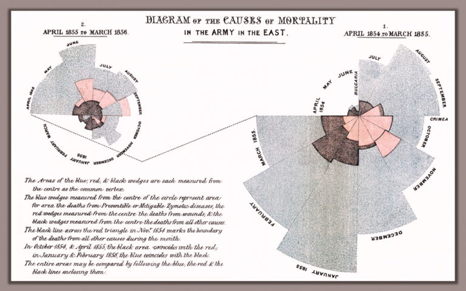
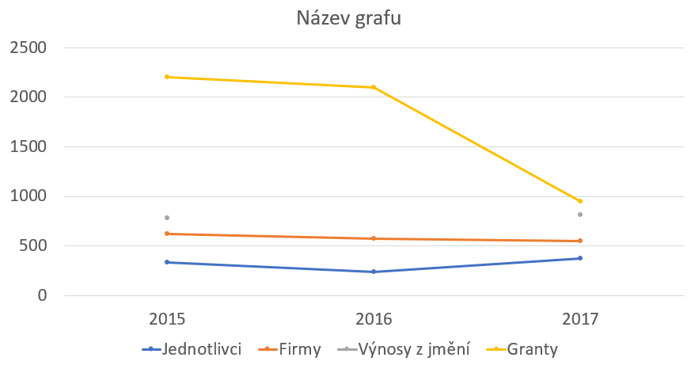
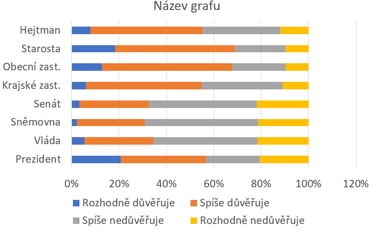
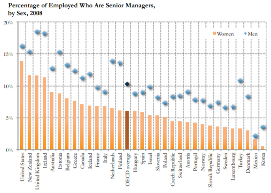
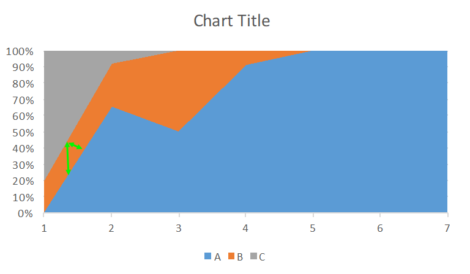

```{r setup, include=FALSE}
knitr::opts_chunk$set(echo = FALSE, warning = FALSE, message = FALSE)

```

```{r libs and data}

library(tidyverse)
library(here)
library(ggeffects)
library(scales)
library(patchwork)
library(summarytools)
library(palmerpenguins)
library(cowplot)
countries <- read_rds(here("slides","data", "countries.rds"))

```

```{=html}
<style>
.forceBreak { -webkit-column-break-after: always; break-after: column; }
</style>
```
## What to expect

- Why visualizations rather than text
- General principles of visualization
- Grammar of graphics


# Why visualizations rather than text

## Florence Nightingale and the Crimean War (1850s)

::: {.centered}

:::

<font size="2">[Source Highcharts.com](https://www.highcharts.com/blog/tutorials/166-nightingale-s-diagram/)</font>

::: {.notes}
Blue diesease from poor hygiene. Red battle wounds, Black other causes. **Nightingale**: first female fellow of the Royal Satistical Society, teamed up with a brilliant statistician of poor parents William Farr who lacked Nightingale's fame and political connections. About lobbying with Queen Victoria: 'She may look at it because it has pictures.' 16 000 of the 18 000 deaths were from preventable disease.
:::

## John Snow and the cholera epidemy on London

::: {.centered}
{width="55%"}
:::

<font size="2">[Source Highcharts.com](https://en.wikipedia.org/wiki/File:Snow-cholera-map-1.jpg)</font>

::: {.notes}
Thanks to Snow's visualizations, suspicion fell on water sources rather than 'bad air' which was the main suspect of causing cholera until then.
:::

## Count all the threes

::: {.centered}

:::

<font size="2">Source @ware2012</font>

## Count all the threes now

::: {.centered}

:::

<font size="2">Source @ware2012</font>

## We remember better visually

::: {.centered}

:::

<font size="2">Source @medina2014</font>

::: {.notes}
Sight is our main sense, we see the world through images. We have to decode the text first and then imagine what it means in the abstract.
:::

# General principles of visualization

## Eduard Tufte

A key figure in the modern approach to visualization of information.

Chartjunk; data : ink ratio; data density; micro - macro reading.

::: {.notes}
**Chartjunk** unnecessary decorations, **data : ink ratio** - trying to maximize, i.e. capture a lot of data using little ink; **data density** - trying to display as much data as possible while emphasizing the main trends; **micro-macro reading** from the chart are clear trends, but at the same time offers the possibility of detailed inspection.
:::

## General principles of visualization

1) Emphasis on data
2) Readability
3) Integrity

# PRINCIPLE 1: Emphasis on data

## PRINCIPLE 1: Emphasis on data

Less is more. Graphs are meant to communicate information effectively, design is meant to support that goal, not obscure it.


::: {.centered}
{width="45%"}
:::

<font size="2">Source @harford2021</font>


## DATA : INK ratio

"Above all else show the data." (Eduard Tufte)

::: {.centered}
{width="75%"}
:::

<font size="2">[Source](https://simplexct.com/data-ink-ratio)</font>

## More is less

::: {.centered}

:::

<font size="2">[Source](http://socialmediaguerilla.com/content-marketing/less-is-more-improving-the-data-ink-ratio/)</font>

## Sometimes a little extra ink is worth it...

::: {.centered}
{width="80%"}
:::

<font size="2">[Source](https://visguides.org/t/data-ink-ratio-principle-how-to-use-it/72/5)</font>

## Do not use 3D charts

::: {.centered}
{width="80%"}
:::

<font size="2">[Source](https://www.slideshare.net/vis4/making-data-visualizations-a-survival-guide)</font>

## This is not just an unnecessary effect, but it actively harms

::: {.centered}
{width="70%"}
:::

<font size="2">[Source](https://www.slideshare.net/vis4/making-data-visualizations-a-survival-guide)</font>

# Do not rely on default

## Excel pie chart

```{r, fig.align='center', fig.cap='Source of funding [thousands CZK]'}
# note, the path needs to add "slides/" before figures to work in console, but be like this to compile
p1 <- ggdraw() + draw_image("figures/excel_default_pie.png", scale = 0.9)
p2 <- ggdraw() + draw_image("figures/excel_remake_pie.png", scale = 0.9)

plot_grid(p1, p2)
```

## Excel pie chart - emphasis

```{r, fig.align='center', fig.cap='Financování dle zdroje, v tisících Kč'}
# note, the path needs to add "slides/" before figures to work in console, but be like this to compile
p1 <- ggdraw() + draw_image("figures/excel_default_pie.png", scale = 0.9)
p2 <- ggdraw() + draw_image("figures/excel_remake_pie2.png", scale = 0.9)

plot_grid(p1, p2)
```

## Excel bar chart {.columns-2}

BEFORE

{width="90%"}

<p class="forceBreak">

</p>

AFTER

{width="90%"}

## Excel bar chart - time series {.columns-2}

BEFORE

{width="90%"}

<p class="forceBreak">

</p>

AFTER

{width="90%"}

## Excel Line Chart {.columns-2}

BEFORE

{width="90%"}

<p class="forceBreak">

</p>

AFTER

{width="90%"}

## Excel Likert scale (diverging chart) {.columns-2}

BEFORE

{width="90%"}

<p class="forceBreak">

</p>

AFTER

{width="90%"}

## Excel Likert scale - alternative version (diverging chart) {.columns-2}

BEFORE

{width="90%"}

<p class="forceBreak">

</p>

AFTER

{width="90%"}

# PRINCIPLE 2: Readability

## PRINCIPLE 2: Readability

Respect for how human cognition works.

::: {.centered}

:::

<font size="2">[Source Christopher G. Healey](https://www.csc2.ncsu.edu/faculty/healey/PP/index.html)</font>

## Pie charts are not suitable for making comparisons

::: {.centered}
{width="70%"}
:::

<font size="2">[Source Wiki](https://en.wikipedia.org/wiki/Pie_chart#/media/File:Piecharts.svg)</font>

## % university-educated in new EU members

```{r fig.height=5.5, fig.pos="center"}
c_com <- 
  countries %>% 
  filter(postsoviet == "yes", eu_member == "yes") %>% 
  filter(!is.na(uni_prc))

gg1 <- 
  c_com %>%
  ggplot(aes(x=country, y=uni_prc))+
  geom_col()

gg2 <- 
  c_com %>%
  ggplot(aes(x=fct_reorder(country, uni_prc, .desc=TRUE), y=uni_prc))+
  geom_col()+
  scale_x_discrete(guide = guide_axis(angle = 90))+
  labs(x=element_blank(),
       y=element_blank())


gg3 <- 
  c_com %>%
  ggplot(aes(x=fct_reorder(country, uni_prc, .desc=TRUE), y=uni_prc))+
  geom_col()+
  scale_x_discrete(guide = guide_axis(angle = 90))+
  scale_y_continuous(labels = label_percent())+
  labs(x=element_blank(),
       y=element_blank())+
  theme_classic()

gg4 <- 
  c_com %>%
  ggplot(aes(x=fct_reorder(country, uni_prc), y=uni_prc))+
  geom_col()+
  geom_text(aes(label = round(uni_prc*100,0)), hjust = 2, color = "white")+
  scale_x_discrete()+
  scale_y_continuous(labels = label_percent())+
  labs(x=element_blank(),
       y=element_blank())+
  theme_classic()+
  coord_flip()

(gg1 + gg2)/(gg3 + gg4)

```

## Example of improved readability and emphasis {.columns-2}

ACTUAL PUBLICATION

{width="90%"}

<p class="forceBreak">

</p>

SUGGESTION FOR IMPROVEMENT

{width="75%"} 

<font size="2">[Schwabish, J. A. (2014) An Economist's Guide to Visualizing Data](https://pubs.aeaweb.org/doi/pdf/10.1257/jep.28.1.209)</font>

## "Small multiples" improve readability of time series {.columns-2}

ACTUAL PUBLICATION

{width="90%"}

<p class="forceBreak">

</p>

SUGGESTION FOR IMPROVEMENT

{width="90%"}

<font size="2">[Schwabish, J. A. (2014) An Economist's Guide to Visualizing Data](https://pubs.aeaweb.org/doi/pdf/10.1257/jep.28.1.209)</font>

## If you have a flexible tool, you can be creative...

```{r, fig.align='center'}
# note, the path needs to add "slides/" before figures to work in console, but be like this to compile
p1 <- ggdraw() + draw_image("figures/comparison1.png", scale = 0.9)
p2 <- ggdraw() + draw_image("figures/comparison2.png", scale = 0.9)
p3 <- ggdraw() + draw_image("figures/comparison3.png", scale = 0.9)
p4 <- ggdraw() + draw_image("figures/comparison4.png", scale = 0.9)

plot_grid(p1, p2, p3, p4)
```

<font size="2">[Schwabish, J. A. (2014) An Economist's Guide to Visualizing Data](https://pubs.aeaweb.org/doi/pdf/10.1257/jep.28.1.209)</font>

## Careful with this one...

::: {.centered}
{width="70%"}
:::

May be useful for two categories

## Well-managed data density

::: {.centered}
{width="90%"}
:::

<font size="2">Source [Financial Times](blogs.ft.com/ftdata/2015/04/17/eu-unemployment-tracker/)</font>

# PRINCIPLE 3: Integrity

## PRINCIPLE 3: Integrity

You decide what message visualization brings to the forefront. But you are also responsible for possible distortions or manipulations.

::: {.centered}

:::

## How much are the prices of flats rising?

::: {.centered}
{width="60%"}
:::

## The big problem with the y axis {.columns-2 .smaller}

{width="95%"}

<p class="forceBreak">

</p>

```{r, echo=FALSE,out.width="95%", out.height="20%",fig.show='hold',fig.align='center', fig.cap='axis y in -20 mil. (top), in 0 (bottom)'}

knitr::include_graphics(c("figures/byty2.jpg","figures/byty3.jpg"))

```

## Sometimes the y-axis is arbitrary

```{r, echo=FALSE,out.width="49%", out.height="20%",fig.show='hold',fig.align='center'}

knitr::include_graphics(c("figures/teplota_a.png","figures/teplota_b.png"))

```

## Sometimes, we just need to "zoom"

::: {.centered}
{width="90%"}
:::

## SO if the y-axis does not start at 0 ...

- ... use "line chart" rather than "bar chart"
- ... highlight the fact

::: {.centered}
{width="70%"}
:::

<font size="2">[Source Highcharts.com](https://medium.economist.com/why-you-sometimes-need-to-break-the-rules-in-data-viz-4d8ece284919)</font>

## Should we be the least worried about poverty of all European countries?

::: {.centered}
{width="70%"}
:::

<font size="2">[Source Eurostat](https://ec.europa.eu/eurostat/web/products-eurostat-news/-/edn-20211015-1#:~:text=In%202020%2C%20there%20were%2096.5,data%20published%20by%20Eurostat%20today.)</font>

## Visualizing uncertainty

Data from July 2021

::: {.centered}
{width="80%"}
:::

## Uncertainty can also be visualized in model estimates

```{r}

m1 <- lm(hdi ~ uni_prc, data = countries)

p1 <- 
  countries %>% 
  ggplot(aes(x=uni_prc, y=hdi))+
  geom_point()+
  geom_smooth(method = "lm")+
  scale_x_continuous(labels = label_percent())+
  theme_classic()+
  labs(x="Percentage university educated",
       y=element_blank(),
       title = "Countries's human development index predicted by university education",
       subtitle = "Human development index measured on a scale 0-1", 
       caption = "35 European countries are displayed")

p1

```

## A true visualization, BUT...

::: {.centered}

:::

<font size="2">[Source](https://www.benzinga.com/analyst-ratings/analyst-color/17/06/9675339/celebrating-the-10th-anniversary-of-the-iphone-a-look-ba)</font>

## General principles of visualization - SUMMARY {.smaller}

Emphasis on data

- Default settings often need to be changed
- Keep only those chart elements that have an informational value
- Do not use 3D charts
- Think about what you want the chart to say

Readability

- Respect human cognition
- Horizontal chart labels are better than vertical
- Think about the context in which the reader encounters the chart
- Be inspired by creative approaches

Integrity

- Be careful with the y-axis
- Communicate the meaning of what you visualize
- Take into account the degree of uncertainty


::: {.notes}
**Emphasis on data** The data does not speak for itself, you decide what you want visualization to highlight (but you must not manipulate); use colors as a carrier of information, not as an ornament; **Readability** If possible, describe the data directly in the chart; minimize the use of pie charts); Customize your visualization to your purpose (easier for presentations, more complex to articles); The figure caption on the slide does not have to just name the displayed topic, it can tell a story. In the article, we mostly tell the story in text.
:::

# Visualization architecture \n(grammar of graphics)

## Leland Wilkinson and 'The Grammar of Graphics' (book)

What makes a good visualization? Individual components...

1) Data
2) Variables
3) Algebra
4) Scale
5) Geometry (line chart, bar chart, ...)
6) "Aesthetics" (colors, shapes, saturation, ...)
7) ...


## Hadley Wickham and developing a software solution of Wilkinson's ideas

::: {.centered}

:::

## ggplot2 {.smaller}

Seven chart layers. Three required:

<ol>

<li>

Data

<li>

Aesthetics - mapping information to color, shape, saturation, ...

<li>

Geometry - graphic elements that represent data

</ol>

Four "extra":

<ol start=4>

<li>

Facets (small multiples)

<li>

Aggregated statistics (e.g. regression curve)

<li>

Coordinate editing (e.g. logarithmic scale)

<li>

Theme (theme) - chart design

</ol>


## Data {.smaller}

```{r}
head(penguins)
```

```{r echo = TRUE, fig.height=2}
ggplot(data = penguins)
```

## Aesthetics {.columns-2 .smaller}

- Axes
- Outline
- Fill
- Size
- Transparency
- Shape
- ...

<p class="forceBreak">

</p>

```{r echo = TRUE, fig.width=4}
ggplot(data = penguins, 
       aes(x = sex))
```

## Geometry {.columns-2 .smaller}

- lines
- points
- columns
- histogram
- boxplot
- ...


<p class="forceBreak">

</p>

```{r echo = TRUE, fig.width=4}
ggplot(data = penguins, 
       aes(x = sex)) + 
  geom_bar()
```


## Geometry 2 {.columns-2 .smaller}

- lines
- points
- columns
- histogram
- boxplot
- ...

<p class="forceBreak">

</p>

```{r echo = TRUE, fig.height=3.5, fig.width=4}
ggplot(data = penguins %>% 
         filter(!is.na(sex)), 
       aes(x = sex,
           y = bill_length_mm)) + 
  geom_boxplot() +
  theme_classic()
```


## Galery 1

::: {.centered}
{width="75%"}
:::

<font size="2">[Galerie ggplot2](https://r-graph-gallery.com/)</font>

## Galery 2

::: {.centered}
{width="75%"}
:::

<font size="2">[Galerie ggplot2](https://r-graph-gallery.com/)</font>

## Galery 3

::: {.centered}
{width="55%"}
:::

<font size="2">[Galerie ggplot2](https://r-graph-gallery.com/)</font>

## Galery 4

::: {.centered}
{width="99%"}
:::

<font size="2">[Galerie ggplot2](https://r-graph-gallery.com/)</font>

## Galerie 5

::: {.centered}
{width="50%"}
:::

<font size="2">[Galerie ggplot2](https://r-graph-gallery.com/)</font>

## Courtesy

This presentation naturally draws on a hard-to-imagine volume of work of a hard-to-imagine number of people.

Nevertheless, I would especially like to thank [Petr Bouchal](https://petrbouchal.xyz/). With him, in 2016, we prepared a course on the methodology of science at the summer academy for high school students [Discover](https://discover.sk/cs/), where we devoted a lot of space to visualization. Petr was also a guest lecturer in my courses at Faculty of Arts, CU, and it was only during his lectures that I fully appreciated the value of seeing visualization as a full-fledged auxiliary scientific discipline. I became acquainted with a number of examples in this presentation thanks to Petr


## Additional resources - principles and applications {.smaller}

1)  [Jonathan Schwabish - blog](https://policyviz.com/)
2)  [The Economist and the daily charts](https://www.economist.com/graphic-detail)
3)  [Hans Rosling's Gapminder](https://www.gapminder.org/)
4)  [Office for National Statistics](https://www.gapminder.org/) - Presenting data
5)  (CZ language) Six tips for good visualizations by [Průvodce evaluátora](https://www.dotaceeu.cz/getmedia/3ce5f6b9-24cc-4ac1-80d9-9eb769203f5a/Pruvodce-evaluatora_final_202007.pdf.aspx) - Collection of evaluation tips and recommendations
6)  [The Data Visualization Checklist](https://stephanieevergreen.com/updated-data-visualization-checklist/)
7)  Selected principles discussed at [the blog by a data journalis at the Economist](https://medium.economist.com/why-you-sometimes-need-to-break-the-rules-in-data-viz-4d8ece284919)
8)  [Makeover Monday](https://www.makeovermonday.co.uk/)
9)  [Excel charts](https://excelcharts.com/)
10) [Visualization fuck-ups](https://viz.wtf/) - for a laugh

## Additional resources - working with ggplot2 {.smaller}

1)  Some lectures of the course I co-teach [Introduction to data analysis in R](https://sociology-fa-cu.github.io/Uvod_do_analyzy_dat_v_R/)
2)  Chapter [Graphics for Communication](https://r4ds.had.co.nz/graphics-for-communication.html) in the book R for Data Science
3)  [The book ggplot2](https://ggplot2-book.org/) by Hadleyho Wickhama
4)  Big [galery of charts in ggplot2](https://r-graph-gallery.com/) including the code how they were created
5)  As part of the [galery website](https://www.data-to-viz.com/caveats.html) mentioned in the bullet above, you can also find an interesting overview of theoretical visualizations tips

## Referenced literature and other sources {.smaller}

If the resources referenced in the presentation are not interactive (they do not contain a link directly to their location), you can find them in the list here: